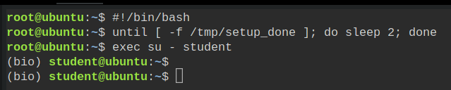

# Lab 08 Homework (Part 2) — Alternate Environment

The course server is unreachable — this VM is a drop-in replacement.

This is **Part 2 of 2** — annotation and resistance screening. It works on a **pre-staged
reference assembly**, not your own Part 1 output — Killercoda VMs don't carry state between
scenarios, so there's no way to hand your file over. This assembly was built with the exact
same `megahit` command on the same reads and verified to reproduce the answer key's stats
(N50, contig count, total length, BUSCO score all match). The one thing that can vary between
separate `megahit` runs is the arbitrary `k141_XXX` contig numbering — not the DNA content — so
if a gene sits on a different-numbered contig than you expect, that's expected, not an error.

All 4 tools this part needs — `quast`, `busco`, `prokka`, `abricate` — are installed and
activated automatically on login, ready to run directly. You never need to type
`conda activate` or `conda create` — it's already done. Environment is loading in the
background — this one takes longer than the others (several tools to install).

> **After you press Start, wait for the prompt to change** from root@ubuntu to (tools)
> student@ubuntu before typing anything — this can take **3–5 minutes**, longer than the
> other homework scenarios (4 heavy tools to install). Just wait. Killercoda can be laggy —
> if it's still root@ubuntu after 5+ minutes and nothing is happening, **reload the page and
> restart the scenario**.

Follow the **Lab 08 homework PDF on Moodle** for full task instructions. This scenario only
gives you a place to run them and a way to get `answers_2.txt` back out.
